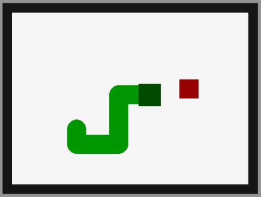

# Snake Game
Simple snake game made with Python and Pygame.
* This game doesn't use a grid based movement system.
* You can move with WASD keys.
* You can configure "variables.py" file to change basic settings.
## How to run the game
You need  to run the "game.py" file after installing Python.
## Screenshot

